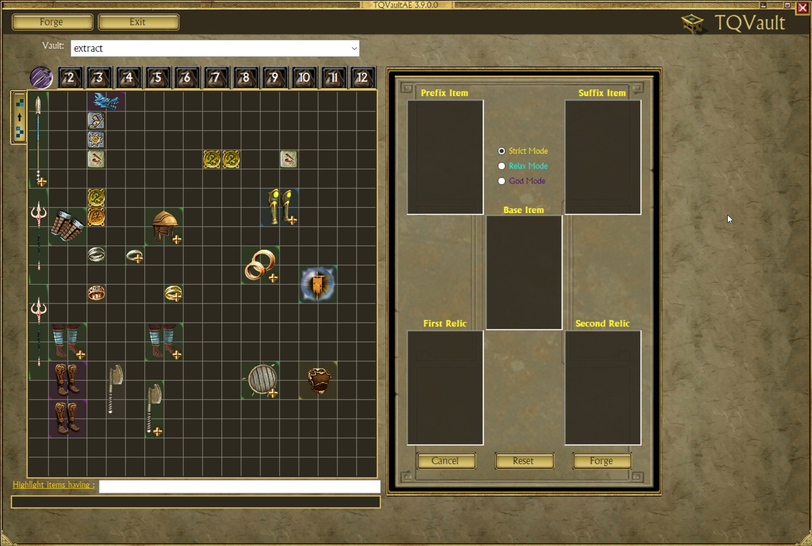
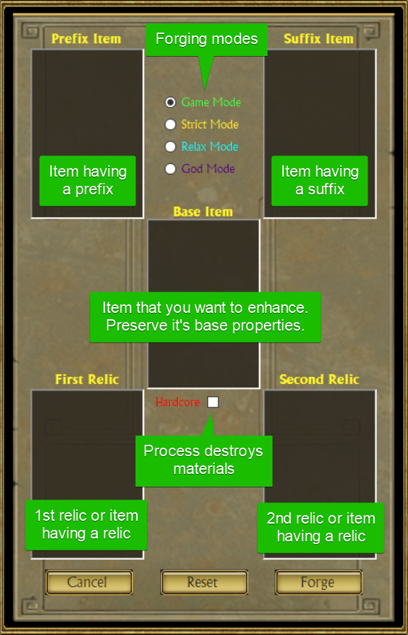
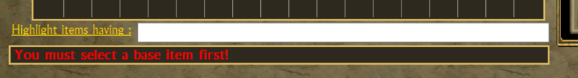
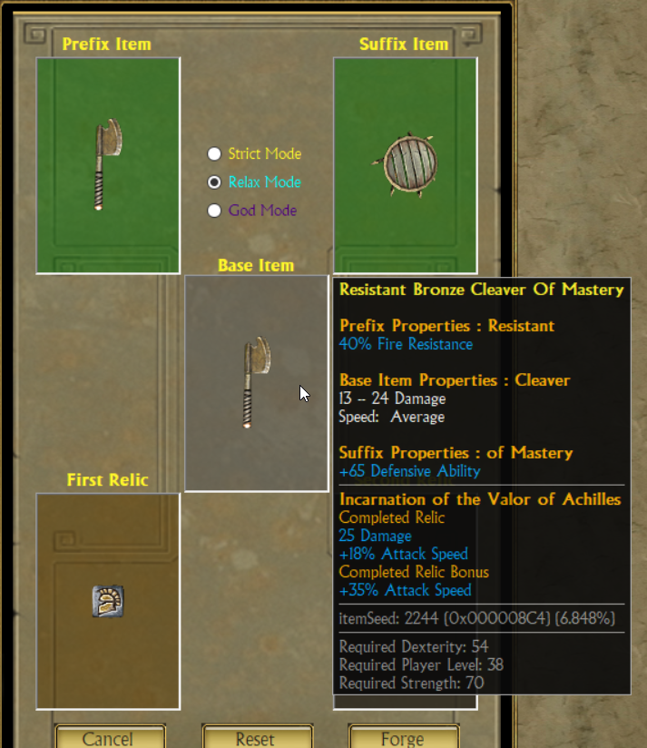
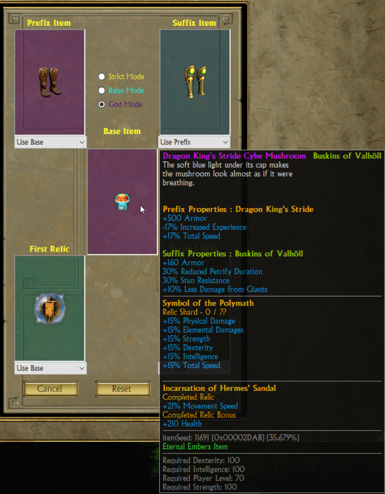

# Custom crafting system

Item crafting should have been in this game. 

TQVaultAE provide a dedicated crafting system that helps you create the item of your dream.

## Table of contents
* [Forge UI](#UI)
* [Notifications](#Notifications)
* [Tooltip Preview](#TooltipPreview)
* [Crafting Modes](#Modes)
    + [Strict](#StrictMode)
    + [Relax](#RelaxMode)
    + [Hephaestus](#GodMode)

### The Forge UI
**_The Forge is an "Item Editing" feature and must be enable in the tool settings._**

You can access the forge from TQVaultAE upper navigation bar. 
Once inside you can drag & drop items from your left vaults.

_**Note:** The Forge doesn't move your objects, however, it changes the properties of the base item used._

Forging or cancelling, return TQVault UI in it's previous state.

### Notifications
Some actions may be prohibited depending on the mode used.

The Forge will emit a failure sound and display a message in the TQVaultAE notification area.

### Tooltip Preview
During the forging process, the deposited items have their tooltip in detail 
mode and the tooltip of the base item displays the preview of the final result.

_**Note:** Here's an example of a white item getting stronger._

### Crafting Modes
Crafting modes allows you to play as you want.
 
Do you want some restrictions as the game would have probably put in place or the crazyness of an OP item that break the game ?

#### Strict Mode
Strict mode is an attempt to be the closest of a genuine Titan Quest crafting experience.
It does not create overpowered items.

Here the list of the restrictions
+ You can't use Epic/Legendary items
+ Prefix/Suffix items must be of the same type as Base items (e.g., Axe with Axe).
+ Prefix/Suffix items can't have greater gear level than Base item (e.g., Prefix from an "Rare" with "Common" Base item).
+ You can't have a second relic without "Of the Tinkerer" Suffix.
+ Only Weapon/Shield/Armor/Jewellery is allowed.
+ 1st/2nd Relic must be of type relic or charm.
+ 1st/2nd Relic gear contraint is enforced (e.g., a "shield only" relic with an "Axe" as Base item is rejected).

#### Relax Mode
Relax mode break many game rules but keep the item structure intact.
+ You CAN use Epic/Legendary items.
+ You can mismatch gear type.
+ Gear level restriction is removed.
+ "Of the Tinkerer" Suffix is not required for a second relic.
+ 1st/2nd Relic can be a relic/charm or an item having one of those. (it still use the relic)

#### God Mode
In this mode, you are blessed by *Hephaestus the Greek God of Blacksmithing* himself.
 
You can create game breaking items. Even useless one.

All restrictions are lifted.
The UI change to let you peek & choose each property group you want to inherit.

**Be aware that the game may ignore some crafting combination. (e.g., artifact can't be crafted (base item) but can be used as material)**

_**Note:** Here's an example of a useless quest item with offensive properties._
 

 

**May the power of Hephaestus be with you!**