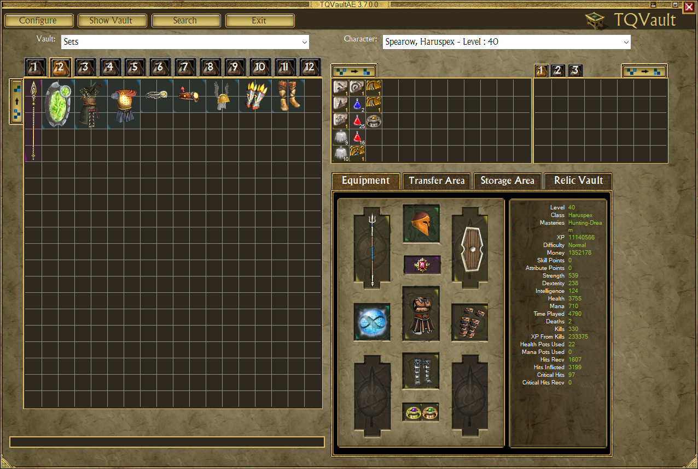

# TQVaultAE

TQVaultAE is an external tool for [Titan Quest Anniversary Edition](https://www.thqnordic.com/games/titan-quest) that allows you to store and search your items outside the game.
Works with all expansions!

## Features
- **Infinite bank space**
- [Share / Import items](documentation/IMPORT_EXPORT.md) — share items, tabs, and vaults via clipboard, `.json` files, or PasteBin URLs.
- [Powerful search](documentation/ADVANCEDSEARCH.md)
- Cheats 
    - Items
        - [Extract relic/charm from items at no cost, keeping both](documentation/AFFIXES.md#relics-removal)
        - [Modify the relic/charm/artefact completion bonus](documentation/AFFIXES.md#relic-and-charm-completion-bonus-change)
        - [Complete relic/charm from a single piece](documentation/AFFIXES.md#relic-and-charm-completion)
        - [Craft an artifact from its recipe](documentation/AFFIXES.md#artefact-creation)
        - [Change item seed](documentation/AFFIXES.md#item-seed-change)
        - [Create missing set pieces](documentation/AFFIXES.md#create-missing-set-pieces)
        - [Craft custom items](documentation/FORGE.md)
        - [Change items affixes](documentation/AFFIXES.md#prefix-change)
        - Duplicate any item
    - Characters
        - Redisribute attribute points
        - Unlock difficulties
        - Level up
- [Support of Titan Quest 2006](documentation/TQORIGINAL.md)
- QOL
    - [Cloud saving](documentation/GITBACKUP.md)
    - Bulk item transfer
    - [Highlight items](documentation/HIGHLIGHT.md)
    - Combine stacks (potions, relics and charms) by dropping them onto each other
    - Split potion stacks apart
    - [Many keyboard shortcuts](documentation/SHORTCUTS.md)
- [Character management](documentation/CHARMANAGE.md)
- Character backups
    - If an error occurs, backups are located at `My Documents\My Games\Titan Quest\TQVaultData\Backup`
- External tools
    - [ARZ Explorer](documentation/ARZEXPLORER.md) : Game resource file exploration
    - [Save File Explorer](documentation/SAVEFILEEXPLORER.md) : Game save file exploration

## Installation

1. Navigate to the [release page](https://github.com/EtienneLamoureux/TQVaultAE/releases)
2. Download the latest release's `.zip` file.
3. Extract the content of the archive on your computer.
4. Navigate to the folder where you extracted the artefacts. Double-click `TQVaultAE.exe`
5. Enjoy!

## Configuration
The "Configure" button (top-left) opens up the configuration menu. That's where you can change:
- The language used by the application
- The paths where the vault files are located
- The paths where the game files are located
- The cheats (To enable/disable these options, see the F.A.Q. below)
- Every vault button can be customized using in-game pictures

## Troubleshooting and F.A.Q.

See [Troubleshooting and F.A.Q.](documentation/TroubleshootingAndFAQ.md)

## Contributors
This project could not go on without the continued volunteer contributions of the Titan Quest community. If you're thinking about contributing, please read our [contributing guidelines](/CONTRIBUTING.md).

### TQVaultAE
- [Open-source contributors](https://github.com/EtienneLamoureux/TQVaultAE/graphs/contributors)

### TQVault

- Brandon "bman654" Wallace, *original author*
- saydc, *item stats*
- Jesse "VillageIdiot/EJFudd" Calhoun, *item stats & ARZExplorer util*
- AvunaOs, *new UI*

#### Translation team

- FOE, *german*
- Jean, *French*
- Vifarc, *French*
- Cygi, *Polish*
- Xelat, *Russian*
- Kurrus, *Spanish*
- Klauhs, *Portuguese*

## Disclaimer
Titan Quest, THQ and their respective logos are trademarks and/or registered trademarks of THQ Nordic AB. This non-commercial project is in no way associated with THQ Nordic AB.
