# Advanced Search

This form brings great search capabilities to TQVault.
It can not only help find items but also theory craft.

_**This tool is meant to be used with "Preload All" setting enabled.**_

_**The first load can be long but reopening the form si fast.**_

---

## Table of contents
+ [Fulltext search](#Fulltext)
+ [Regex search](#Regex)
+ [Category visibility](#ShowHide)
+ [Category filtering](#CategoryFilter)
+ [Uncheck all](#UncheckAll)
+ [Display match during selection](#DispMatch)
+ [Reduce categories during selection](#Reduce)
+ [Logical operator](#AndOr)
+ [Query persistance](#Query)
+ [Flexible visibility](#Flexible)
+ [Preview tooltip](#Preview)
+ [Category tooltip](#CategoryPreview)

---

## UI
Here's a brief overview of some UI features.

---

### Fulltext search
By default, the input is a literal search.

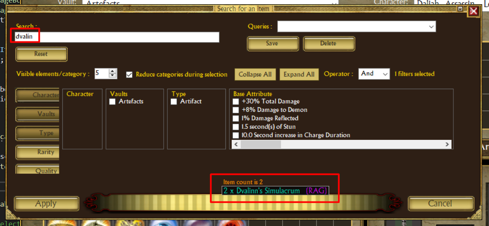

---

### Regex search

By using `/` as first char everything else is a standard [C# regular expression](https://docs.microsoft.com/en-us/dotnet/standard/base-types/regular-expression-language-quick-reference).

Here's few examples.

- `/rune|earth` : Everything with "rune" or "earth"
- `/chance of .+%.+bleeding damage` : All chance of + percent bleeding damage
- `/\+.+%.+(life|mana) leech` : Any + percentage of life or mana leech
- `/\+.+%.+(cold|fire) damage` : Any + percentage of cold or fire leech

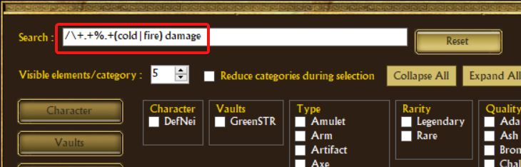

---

### Category visibility
Some categories may have no interest to you.

You can hide it.

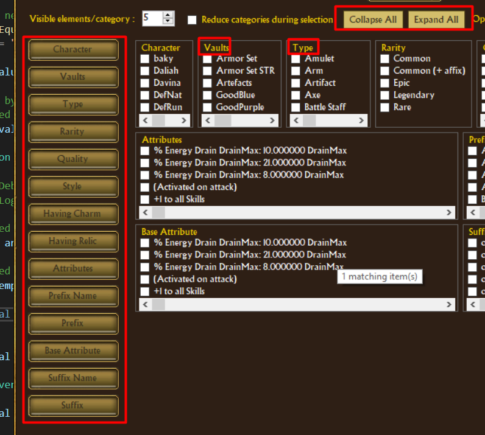

---

### Category filtering
looking for specific categories?

It accept [regular expressions](#Regex).

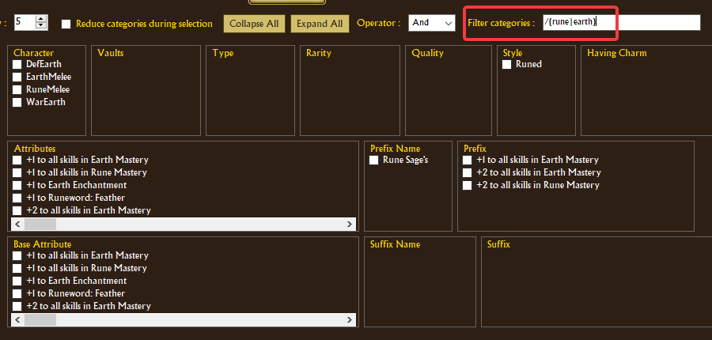

---

### Uncheck all
You can uncheck all selected attributes inside a category by 'right-clicking' the yellow category label.

---

### Display match during selection
The item count adjust in real time.

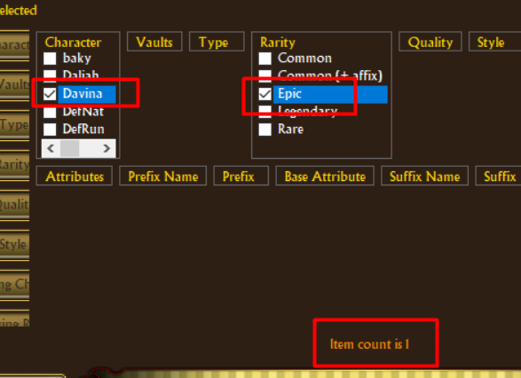

---

### Reduce categories during selection
When that checkbox is enabled, each selection reduce further available categories and items.

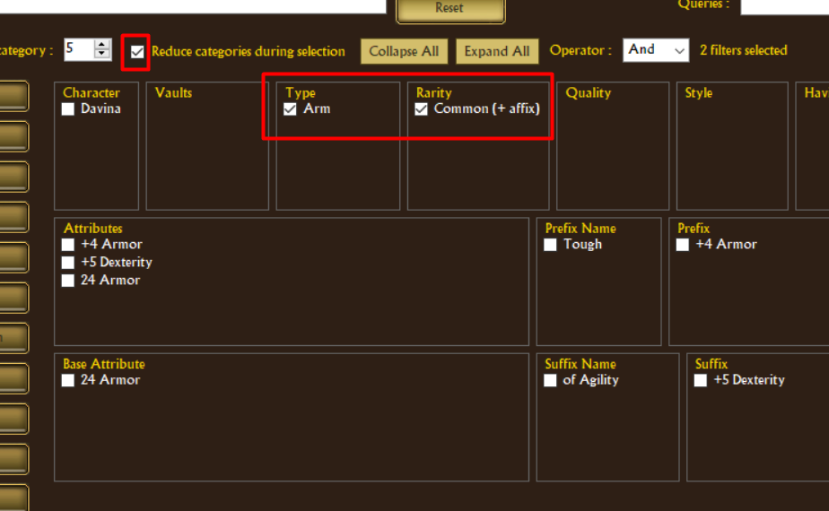

---

### Logical operator
This let you choose logical mode for item filtering.
- _**And**_ : Items must comply **to all** selected categories (Default). 
- _**Or**_ :  Items must comply **to at least one** selected categories .

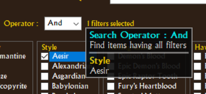

---

### Query persistance
You can save and reload a filter selection.
Don't loose time when you track something complex.

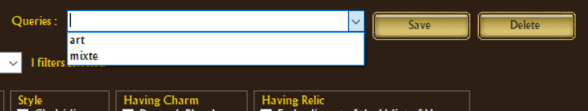

---

### Flexible visibility
You can adjust the number of visible elements per category.

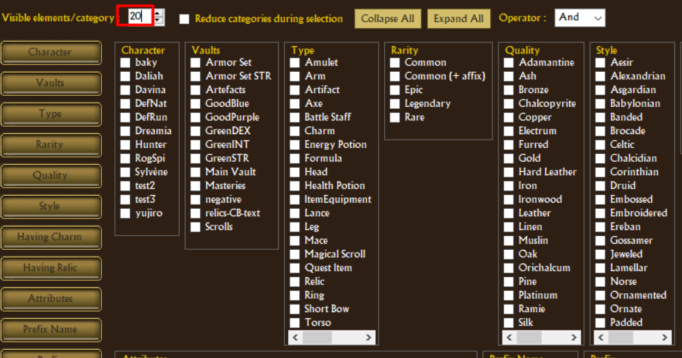

---

### Preview tooltip
Hovering on the item count in the bottom of the windows display a popup with a preview of found items.

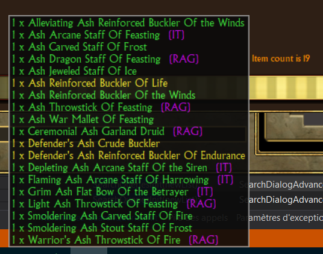

---

### Category preview
Hovering on a category display a tooltip with the number of related items.

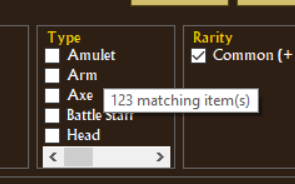

