# Item editing features

Beside the [Forge](FORGE.md) that can be overkill, TQvault let you tweek some items in a respectful manner.

You can choose item affixes from regular loot table instead of farming duplicate and using the forge.

### _Theory crafting made easy!!_

_**Note : "Item editing feature" must be enable in the settings.**_

---

## Table of contents
* [Prefix change](#Prefix)
* [Suffix change](#Suffix)
* [Broken items](#Broken)
* [Affixes removal](#Remove)
* [Affixes display mode](#DisplayMode)
* [Affixes for Epic & Legendary](#Uniques)
* [Artefact creation](#Formula)
* [Artefact completion bonus change](#Artefact)
* [Relic and charm completion](#RelicCompleteStack)
* [Relic and charm completion bonus change](#RelicCompletion)
* [Relics removal](#RelicRemoval)
* [Socketed relic and charm completion bonus change](#SocketedRelicCompletion)
* [Missing records/translations](#MissingRecords)
* [Item seed change](#Seed)
* [Create missing set pieces](#MissingSetPiece)

---

### Prefix change

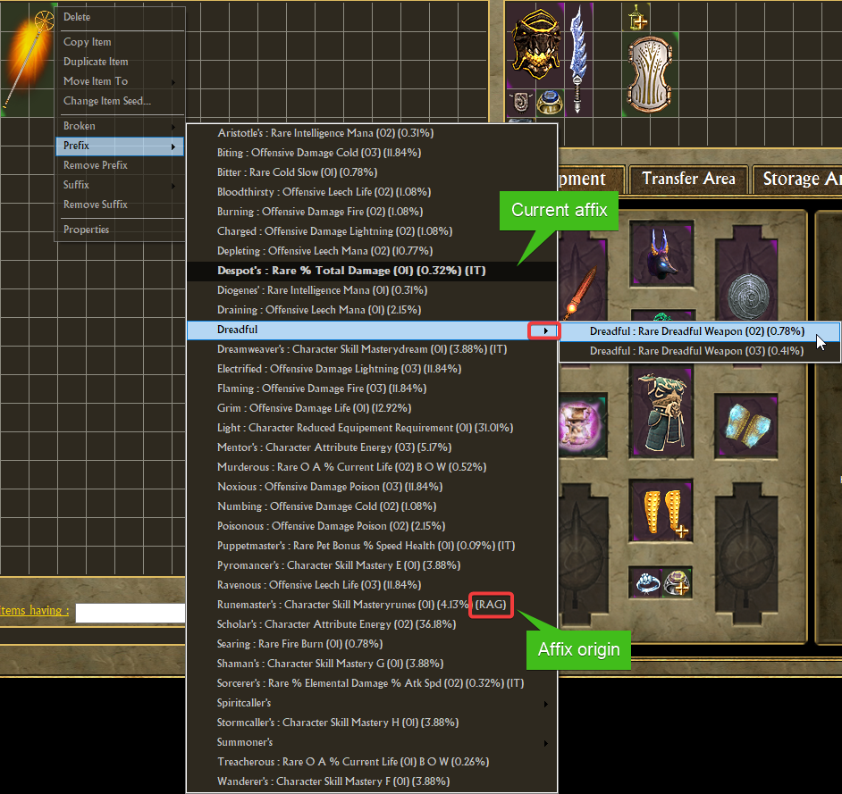

---

### Suffix change

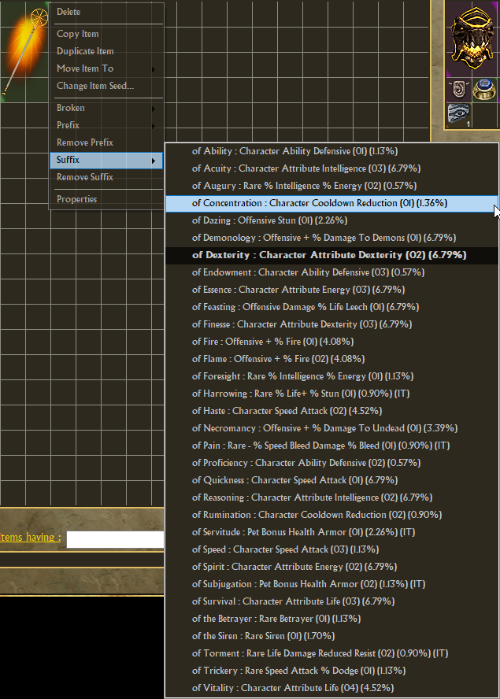

---

### Broken affix when available

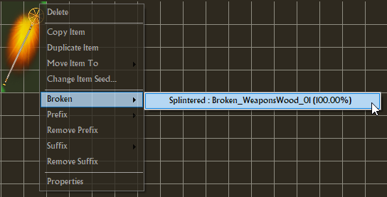

---

### Affixes removal

---

### Affixes display mode

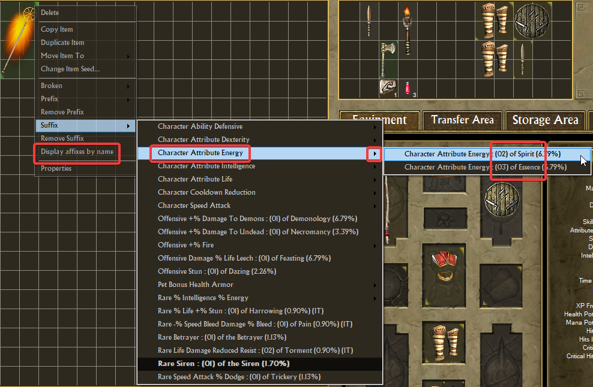

---

### Affixes for Epic & Legendary
You can enable this feature in the settings.

It try to suck all known Prefix/Suffix per gear type (e.g, all affixes for axe if the unique is an axe).

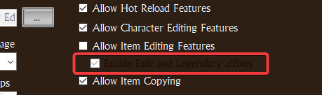

---

### Artefact creation

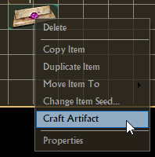

---

### Artefact completion bonus change

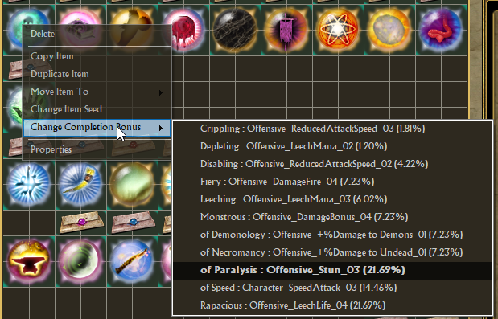

---

### Relic and charm completion

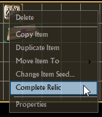

---

### Relic and charm completion bonus change

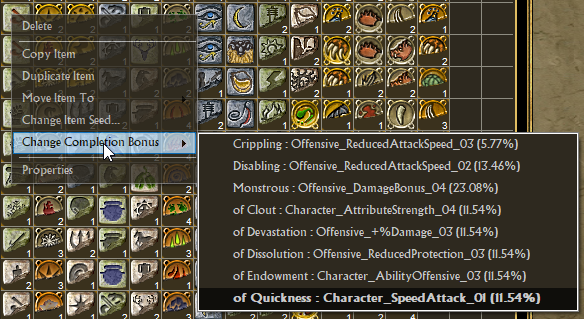

---

### Socketed relic and charm completion bonus change

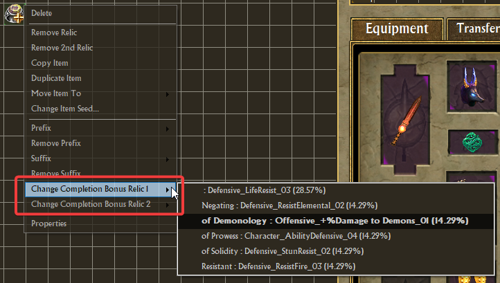

---

### Relics removal

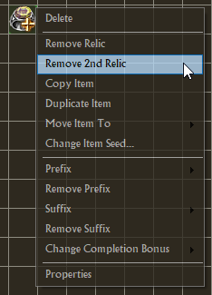

---

### Missing records & translations

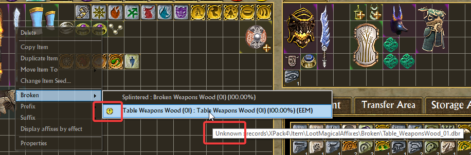

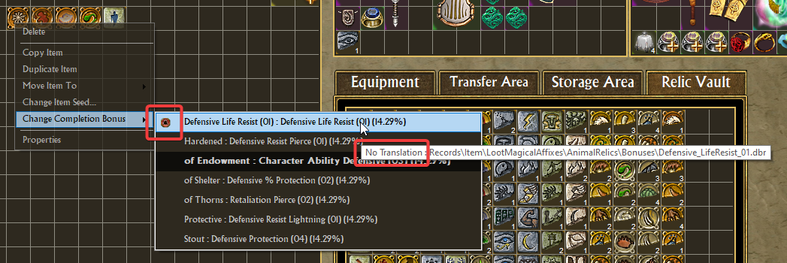

if you want the full list of incomplete records, activate this settings in `TQVaultAE.exe.config`

- DebugEnabled = True
- LootTableDebugEnabled = True

By using the feature, you will see something like [that](affixes/loottablelogs.png) in the log file of the tool (`./Logging` directory).

---

### Item seed change

| 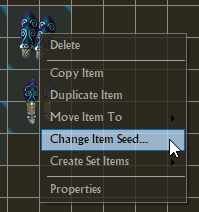 | 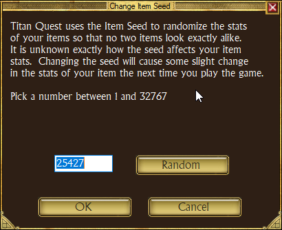

---

### Create missing set pieces

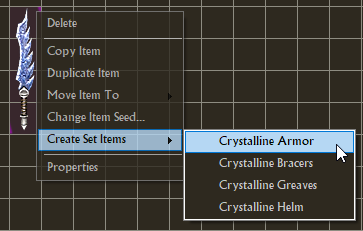

