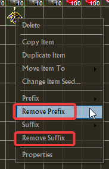

# Item editing features

Beside the [Forge](FORGE.md) that can be overkill, TQvault let you tweek some items in a respectful manner.

You can choose item affixes from regular loot table instead of farming duplicate and using the forge.

### _Theory crafting made easy!!_

_**Note : "Item editing feature" must be enable in the settings.**_

---

## Table of contents
* [Prefix change](#prefix-change)
* [Suffix change](#suffix-change)
* [Broken items](#broken-affix-when-available)
* [Affixes removal](#affixes-removal)
* [Affixes display mode](#affixes-display-mode)
* [Affixes for Epic & Legendary](#affixes-for-epic--legendary)
* [Artefact creation](#artefact-creation)
* [Artefact completion bonus change](#artefact-completion-bonus-change)
* [Relic and charm completion](#relic-and-charm-completion)
* [Relic and charm completion bonus change](#relic-and-charm-completion-bonus-change)
* [Socketed relic and charm completion bonus change](#socketed-relic-and-charm-completion-bonus-change)
* [Relics removal](#relics-removal)
* [Missing records/translations](#missing-records--translations)
* [Item seed change](#item-seed-change)
* [Create missing set pieces](#create-missing-set-pieces)

---

### Prefix change

---

### Suffix change

---

### Broken affix when available

---

### Affixes removal

---

### Affixes display mode

---

### Affixes for Epic & Legendary
You can enable this feature in the settings.

It try to suck all known Prefix/Suffix per gear type (e.g, all affixes for axe if the unique is an axe).

---

### Artefact creation

---

### Artefact completion bonus change

---

### Relic and charm completion

---

### Relic and charm completion bonus change

---

### Socketed relic and charm completion bonus change

---

### Relics removal

---

### Missing records & translations

if you want the full list of incomplete records, activate this settings in `TQVaultAE.exe.config`

- DebugEnabled = True
- LootTableDebugEnabled = True

By using the feature, you will see something like [that](affixes/loottablelogs.png) in the log file of the tool (`./Logging` directory).

---

### Item seed change

|  | 

---

### Create missing set pieces

