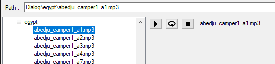
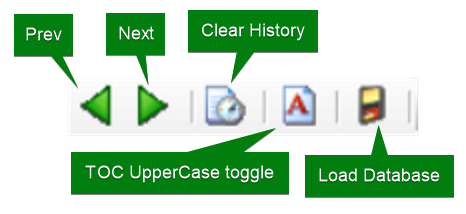

# ARZ Explorer

This tool let you explore Titan Quest *.arc and *.arz game files.

It is very useful for TQVaultAE contributors to be able to dig into these files for support and maintenance reasons.

---

## Table of contents
* [Executable](#Exec)
* [UI](#UI)
    + [Data Panel](#DataPanel)
    + [Toolbar](#Toolbar)
    + [Menu](#Menu)
* [Main TQ Files](#MainFiles)
* [Hidden features](#HiddenFeatures)

---

## Executable
The executable is located in the same directory as TQVault.

Just run `ARZExplorer.exe`.

Create a shortcut on your desktop if you need to access it frequently.

---

## UI
Here's a brief overview of the UI.

---

### Data Panel
This panel adjust it's display to the type of data.

#### Type Record (.dbr)

You can navigate through **multiple files** by following links.

**_The navigation panel load and merge all files dynamicaly._**

#### Type Image (.tex)

#### Type Text (.txt)

#### Type Sound (.Wav/.Mp3)

---

### Toolbar

---

### Menu

- File/Open : Select and open an archive
- File/Exit : Exit tool
- Navigation/Previous : Navigate to previous item
- Navigation/Next : Navigate to next item
- Edit/Copy Path : Copy path to clipboard
- Edit/Copy TXT : Copy text to clipboard
- Edit/Copy DBR : Copy DBR record to clipboard
- Edit/Copy TEX : Copy Image to clipboard
- Edit/Copy Sound : Copy Audio to clipboard
- Extract/Selected File : Unpack a selected archive directly to disk without displaying it.
- Extract/All Files : Unpack the whole database directly to disk without displaying it.
- View/Hide Zero Value : Enable/Disable the display of records holding value equal to zero (default value).
- View/Caps : UpperCase/LowerCase the TOC.
- Help/About : About window 

---

### Main TQ Files

Most resources files are located in these subdirectories of TQ install directory.

- `./Audio`
- `./Database`
- `./Resources`
- `./Resources/XPack`
- `./Resources/XPack2`
- `./Resources/XPack3`
- `./Resources/XPack4`
- `./Text`

---

### Hidden features
Some behaviors are not obvious. So it's describe here.

- Double click inside "Path" textbox copy it's content into the clipboard.
- Double click inside "Data Panel - Type Text" copy it's content into the clipboard.
 