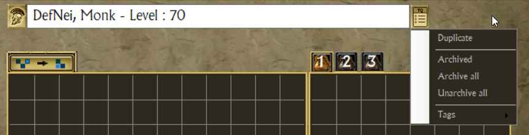
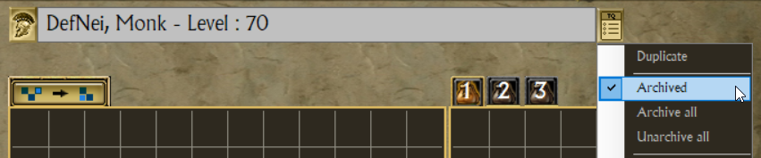
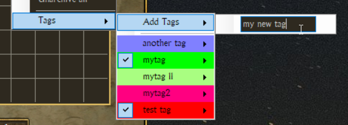
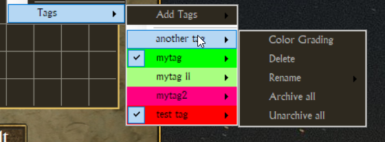
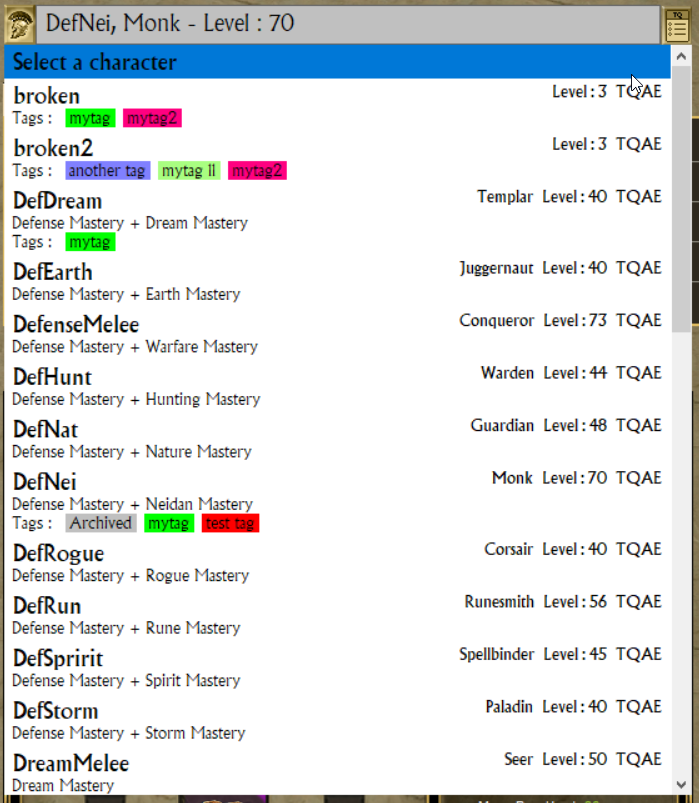

# Character Management

Over time, the number of character saves is growing.
It can be a real chore to scroll through all your characters in the character selection screen of the game.

TQVault let you decide which characters can be loaded in the game and can safely put on the bench the others.

***Note : This feature should not be used on characters that are loaded in game. 
To avoid any trouble, go back to the MAIN screen (NOT the character selection screen).***

## Menu
You can access these features from the button on the right of the character dropdown.

## Duplicate character

TQVault will prompt you for a new name and create a copy of the selected character.

***Note : This is a "character editing" feature.***

## Archiving

An archived character shows a greyed out background color.

*"Archived"* is a toggle.

*"Archive all"* & *"Unarchive all"* apply to all your characters, not only the selected one.

## Tags

TQVault allow you to organize your extensive roster of character by using tags

All tag actions can be done from this menu.

You can also "Archive/Unarchive" your characters by tag.

## Detailed dropdown

The character dropdown display detailed informations on the characters, including tags.

It make it easier to manage your roster.

