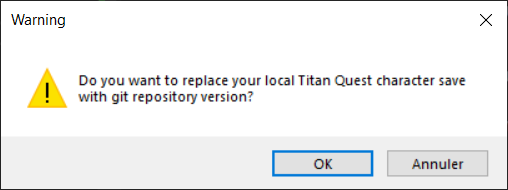

# Cloud Saving

TQVault provide a cloud saving system.

Why that?! We already have Dropbox, Google Sync, etc...

Because we can!

This backup system use **Git**. So TQVaultAE provide ***Versioning*** to your precious vault files and character save files.
That mean 4 important things.

1. You can recover your saves even if your home burn with your computer and your backup hard drives in it.
1. You can sync your local computer with your latest vaults and character saves everytime you run TQVault. Useful when you use different computers often.
1. You can retrieve an older version of your vaults or character saves by using regular git commands or a git UI.
1. You can share your repository with your friends, (e.g. play the same save with your friend in a group speed run marathon challenge?)

You can use a public git repository provider (Github, GitLab, etc...) or your own git server if you have one.

---

## Table of contents
* [Setup](#Setup)
* [Settings](#Settings)
* [Workflow](#Workflow)
* [DO NOT MESS WITH YOUR REPO](#DONOT)
* [Recover an old version of a vault or a character save](#Recover)

---

### Setup

***Note : We explain the main steps for this setup, we don't support git related problems or detailed installation howto. Google it!***

1. Create a git(hub) account.
1. Create a repository.
1. Install [Git for windows](https://gitforwindows.org/) on your machine.
1. Optional : Install a Git UI like [Git Extensions](https://gitextensions.github.io/) or [GitKraken](https://www.gitkraken.com/) (they are many)
1. Check your configuration
    1. Make sure your can `clone` and `push` your repository from the console `CMD.exe`.
    1. Resolve authentication problems if you have any.
1. Configure TQVault "Git Backup" from it's [setting windows](#Settings).
1. The tool should restart.

---

### Git Backup settings

- ***Disable legacy backup*** : stops the existing local backup system in `$(TQVaultData)\Backups`
- ***Backup player saves*** : this backup is optional, the main concern is vault files.
- ***Git Repository Url*** : if you arrived here, you know what it is. If you don't google it.

---

### Workflow

1. Once configured, the first time, TQVault clone your repository and put a junction (Hard link) to your save files in it (it do not copy file and waste disk space).
    1. The clone is in a sub directory of TQVault named `LocalGitRepository`

1. You update your files from TQVault or the game.

1. Every changes you made are pushed to the remote directory on closing.
    1. For thoses who have a lot of saves, it may be long to push all the files in the remote location. The first time may be annoying.
    1. ***Taking a long time uploading 2GO via a DSL line is not a TQVault issue***.
    1. Beside that "first time" it should be fast.

1. Reopening the tool will ask you if you want to restore your files from the last remote version. Most of the time you says `Cancel`.

**For the vaults**

**For the player saves**

That's your new life for now, until a contributor make it smarter.

---

### DO NOT MESS WITH YOUR REPO

***Stupidity is not a TQVault issue.***

Doing stuff like `git reset --hard` on your repo for fun will make you cry!

if you think you misbehave, remember TQVault sync your changes on opening and closing.
So if you did a mess, manually backup your local files before runing the tool again.

We don't take responsibility. 

---

### Recover an old version of a vault or a character save

TQVault use a strict taging based on date time `yy.MM.dd.HHmmss` and the last commit is always tagged `latest`.

These tags are also pushed on the remote repository.

This make it easy to reset a file (or several) to a previous state.

Here's an example of reverting a vault to a previous state in Git Extensions.

*Do this before opening TQVault, so it can display the version you just recover when you open it.*

