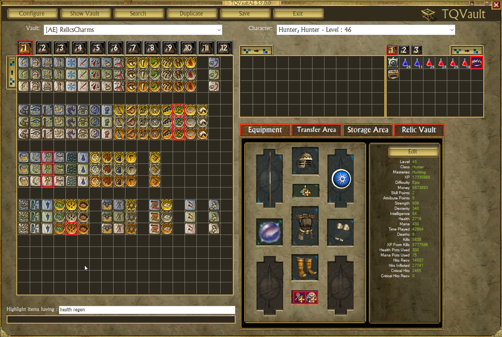
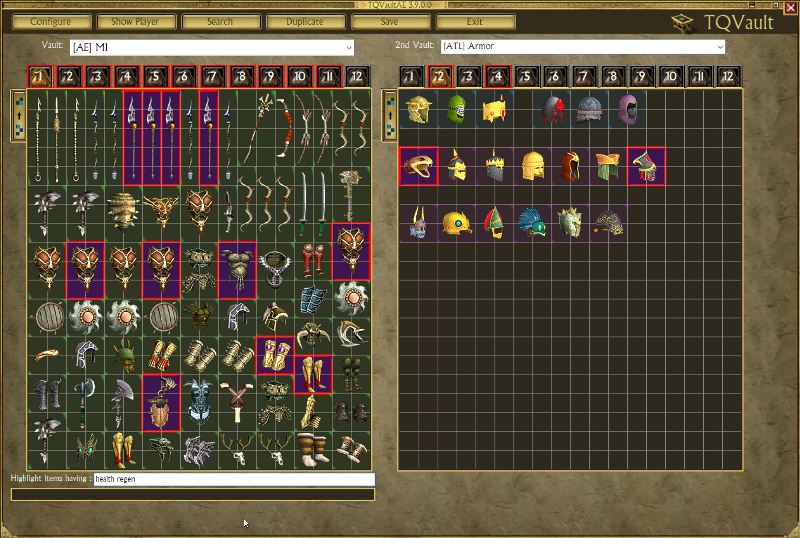
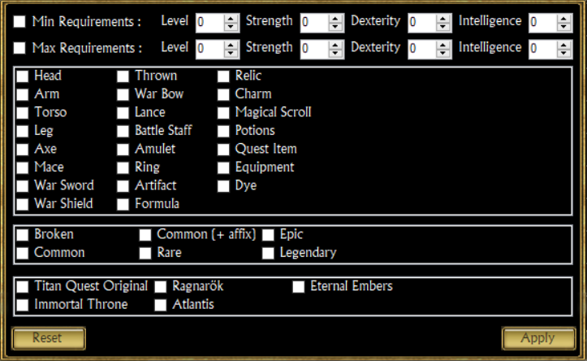
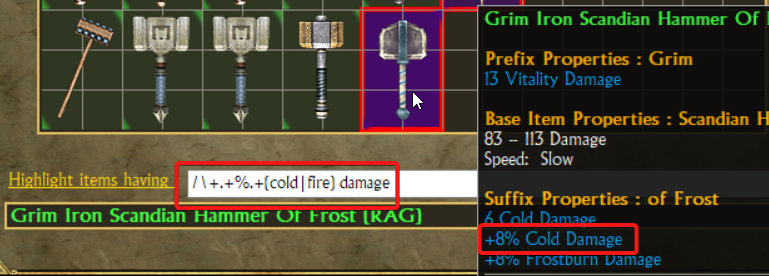

# Highlight system

As an addition to the integrated search engine, an highlight system let 
you find an item quickly directly from the main view.

Looking for "health regen" attribute?

## Vault and Player

## With secondary vault

## Extended filters

You may need to refine your search further.

This popup appear by clicking the label *"Highlight items having"*.

You can create a "requirement range" via Min/Max checkboxes.

_**Note:** Leaving a value to 0 means "ignore"._

## Regular expression

By using `/` as first char everything else is a standard [C# regular expression](https://docs.microsoft.com/en-us/dotnet/standard/base-types/regular-expression-language-quick-reference).

Here's few examples.

- `/rune|earth` : Everything with "rune" or "earth"
- `/chance of .+%.+bleeding damage` : All chance of + percent bleeding damage
- `/\+.+%.+(life|mana) leech` : Any + percentage of life or mana leech
- `/\+.+%.+(cold|fire) damage` : Any + percentage of cold or fire leech

