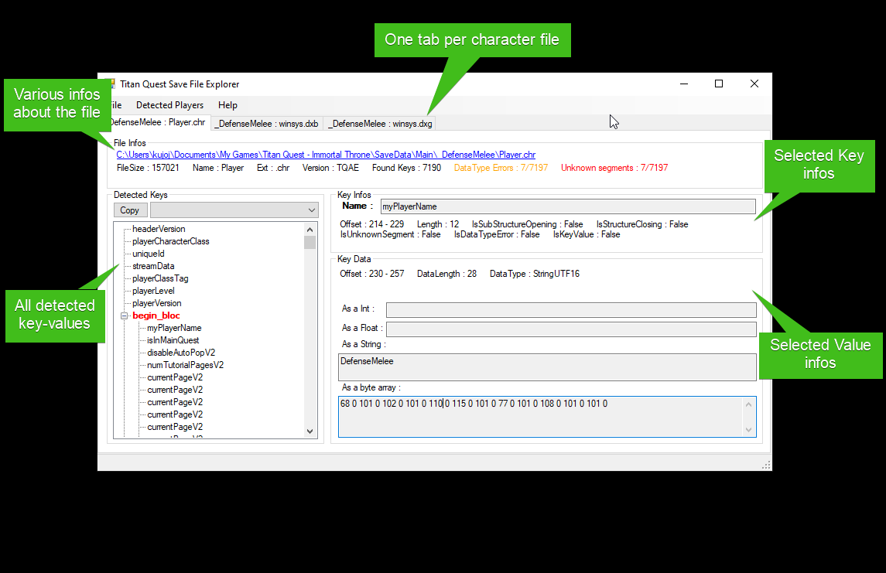
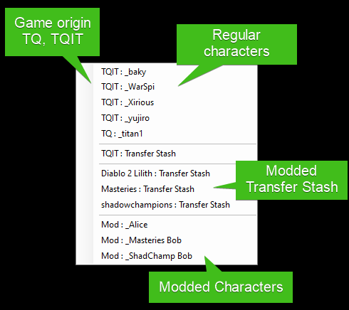
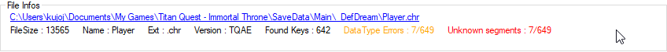
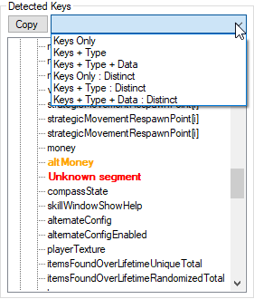
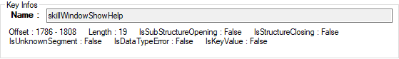
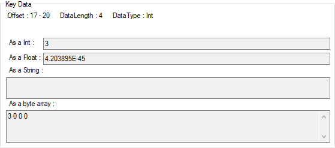
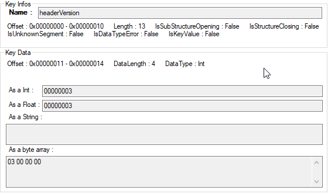

# TQ Save File Explorer

This tool let you explore Titan Quest save files.

It is very useful for TQVaultAE contributors to be able to dig into these files for support and maintenance reasons.

---

## Table of contents
* [Executable](#Exec)
* [UI](#UI)
    + [Menu](#Menu)
    + [File infos](#FileInfos)
    + [Detected keys](#DetectedKeys)
    + [Key Infos](#KeyInfos)
    + [Key Data](#KeyData)
* [Hidden features](#HiddenFeatures)

---

## Executable
The executable is located in the same directory as TQVault.

Just run `TQ.SaveFilesExplorer.exe`.

Create a shortcut on your desktop if you need to access it frequently.

---

## UI
Here's a brief overview of the UI.

---

### Menu

- File/Open player directory : Select character directory and open all player save file inside (player, caravane)
- File/Open file : Select character directory and open a specified player save file
- Detected Players : Easy access to all character files

- Help/About : About window 

---

### File Infos
This panel display file parsing details.

- The link open windows explorer directly to the file.
- DataType Errors : Unknow key count. 
- Unknown segment : Unknow value count. 

---

### Detected Keys
This panel display all detected keys in a tree.

- A known key is displayed in black.
- An unknow key is orange. 
- Unknown segment : Unknow value of the unknow key. 

You can copy keys into clipboard using the dedicated button.
The combobox let you choose what type of data you want.

---

### Key Infos
This panel gives you details about the key.

- `IsSubStructureOpening` : true when the key embed a substructure and can be expanded in the tree. The only known opening key is `begin_block`
- `IsStructureClosing` : true when the key end a substructure. The only known closing key is `end_block`
- `IsUnknownSegment` : true when the tool doesn't recognize a segment of data. _**The tool need update to recognize the data.**_
- `IsDataTypeError` : true when the tool doesn't recognize the type of a key. _**The tool need update to recognize the data.**_
- `IsKeyValue` : true when the key is a known value without key. The only known keyvalue is the `CRC` in transfer stash and character inventory.

---

### Key Data
This panel gives you details about the value.

Nothing special here, it try to display the value in all data types supported by TQ save files.

---

### Hidden features
Some behaviors are not obvious. So it's describe here.

- Click on any labels inside 'key infos' or 'key data' panels changes data display to hexadecimal.

 