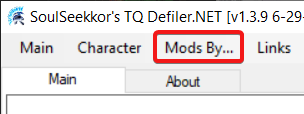
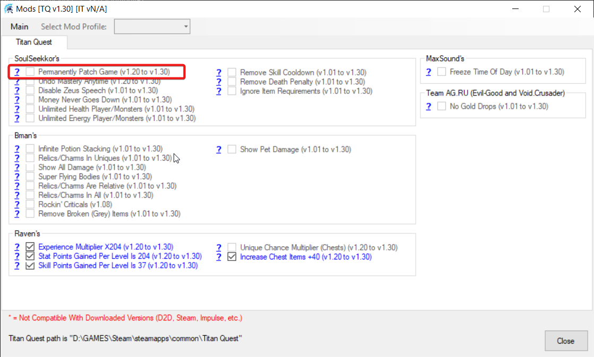
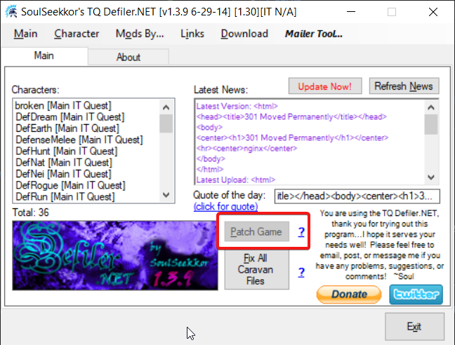
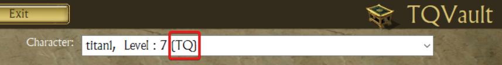
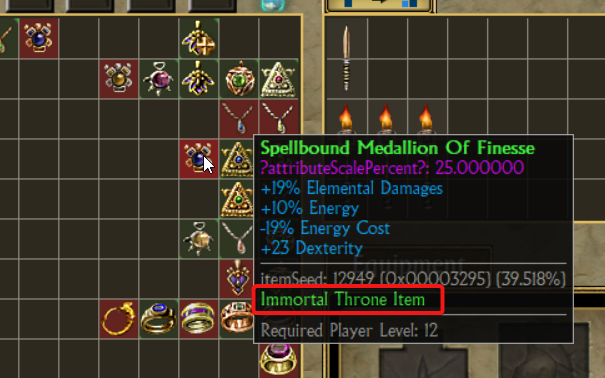

# How to use TQVaultAE with Titan Quest 2006

Titan Quest original from 2006 (TQ) is still available out there [via Steam](https://steamcommunity.com/app/4540/discussions/) (when you buy it before the Anniversary Edition era) or via CD installation.

TQ include an anti-cheat system that prevent external tool to edit character save file.
If you do, vanilla TQ will at best undo your modifications, but more probably will make your character unplayable.

A smart guy, [SoulSeekkor](https://tq.soulseekkor.com/), created a tool that can disable that anti-cheat when you play.\
So TQVault can be used with TQ but you need TQDefiler to use TQVault while you play your character.

TQDefiler can be download at
- [soulseekkor.com](https://tq.soulseekkor.com/downloads.html)
- [moddb.com](https://www.moddb.com/games/titan-quest/downloads/soulseekkor-tqit-defiler)

---

## Table of contents
* [Setup](#Setup)
* [How to play](#Howto)
* [How TQvault help you play Titan Quest 2006](#Help)

---

### Setup

***Note : You must have your TQ installed already.***

1. Download TQDefiler.

1. Run the tool and respond to the various popup.

    1. It will detect you game version. 

1. Run TQVault, enable "Titan Quest original support" in the settings and apply.\

    1. the link "How to play..." leads to this page.

**Note** : The Steam version is recognized as 1.30, but the "Permanent Patch Game" is not working on it.\
***The in process patch IS WORKING though***.

If you own the CD version of TQ, you can use the "Permanent Patch Game"" feature.\
Doing so, you will not be forced to run TQDefiler while using TQVault with TQ.

---

### How to play

1. TQDefiler must be running while you play. So run it first.

1. Run the game.

1. Disable anti-cheat.

    1. TQdefiler detect the game is running and enable that button. Click it.
    

1. Run TQVault.

1. Edit your character in TQVault.

    1. If you want to keep TQVault running and detect character changes while playing,
    enable the "Hot Reload" feature in TQVault settings. This enable the tool to save your changes without closing. There is a new button `Save` in the top navigation bar.

1. Load your character in game.

1. Play.

***Note : very important!*** Every time you want to move an item between TQVault and your inventory or edit something in your TQ character, ***Your game must be on the "main screen", NOT the "character selection screen"***.\
Your character must be unloaded.

---

### How TQvault help you play Titan Quest 2006

#### 1. How to recognize a TQ character file.

Once enabled, all your TQ saves are available in the dropdown with a suffix `(TQ)`.

---

#### 2. Show incompatible items.

Not every items can be used in TQ, and your vaults are full of TQIT+ items, so you need a little help to sort it out.

Incompatible items are shown with a red background.

---

#### 3. Prevent TQIT+ items in your inventory.

You CAN'T move a TQIT+ item in the inventory, bags or equipment panel.

---

Enjoy old school Titan Quest!!!

