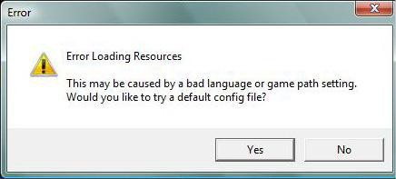
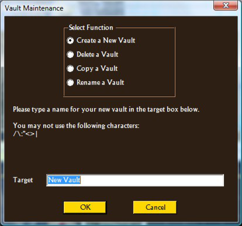

# TQVault Common Issues  
   
## Issue : Error Loading resources  
   
TQVault attempts to start and then displays the following message:  
  
Hitting YES to use the default config file does not help.  
### Solution
This message shows itself when TQVault cannot locate all of the necessary files which are the database.arz file and the text database files. This can also occur if there is an exception during the resource load process. There are many causes for this:   

1. The language setting is incorrect or the language database file cannot be located. Auto detecting should work in most cases though it does not always work. Manually edit the config file for the proper language and turn auto detect game language off. If that does not work, try setting the language to English.   
2. The vault data path is not correct. Try manually correct the vault data path in the config file to the correct location.   
3. The game paths are not correct. Turn auto detecting of game paths OFF and manually insert the game paths into the config file.   

Starting with version 2.2.2.0, if there is an exception it will be displayed as part of the "Error Loading Resources" dialog which should help pinpoint the issues. It also helps to turn on database debugging to help isolate issues. See TQVault debugging below for information on turning on debugging.   
## Issue: TQVault debugging   
If an issue is not known, it is helpful to turn on debugging to help isolate the issue.   
### Solution 
Manually edit the config file to turn on debugging.   
Use the *DebugEnabled* key to globally turn debugging on and off. The level keys will have no effect with this turned off.   
   
- ARCFileDebugLevel - Used for debugging the decoding of the arc files.   
- DatabaseDebugLevel - Used for debugging of decoding and loading the databases. Resource loading issues should be shown here.   
- ItemDebugLevel - Used debugging item stat decoding.   
- ItemAttributesDebugLevel - Used for decoding the format specs of the items.   

The levels range from 0 to 3.   
   
1. No logging except for some error messages.   
2. Basic logging showing entering and exiting of functions.   
3. Includes internals of functions but not loops. This is the most common setting.   
4. Includes the internals of loops. This can slow down the program especially when used with the ARCFile.   

When debugging is enabled, TQVault will create a **./** **Logging** **/*** **.txt** file in your TQVault installation folder.   
   
## Issue: TQVault versions   
What version of TQVault do I have?   
### Solution 
The version number is in TQVault window title.  
   
## Issue: Search Issues
Search is giving unexpected results or your characters name is not selectable.  
### Solution
Search will only search the files which are memory resident, so if the « LoadAllFiles » option is not turned on, only those files which you have manually loaded will be searched.   
If you can stand the additional loading overhead, it is recommended to leave the « LoadAllFiles » option enabled so that all files will be searched.  
There was also a bug identified if your character's name had an underline character (_) which is fixed in version 2.2.2.0.  
   
## Issue: Lost Items, corrupted characters or stash files.  
I have lost some items or the game can no longer access my character or stash.  
### Solution
If you are using vanilla Titan Quest, you will need to run either TQVaultMon or Defiler.NET to access your characters after using TQVault.  
Though I try very hard to avoid corruption issues, they do happen. You should always be able to recover your character, stash or vault files from before the corruption by using a previous backup of the file from the TQVaultData\Backups folder. In addition, if you have a corruption please post the corrupted file and the recovered backup of the file along with a detailed description of what you were doing before the corruption ocurred so that I can try to fix the issue.  
   
## Issue: There is no way to rename, delete or copy vaults.  
How do I copy, rename or delete my vault files?  
### Solution
In version 2.2.1.4 a new dialog called Vault Maintenance was added which replaced the New Vault dialog. You can access the new dialog by scrolling up in the Vault drop down list and selecting « Maintain Vault Files... ».  
The maintenance dialog has the ability to create new vaults and rename, copy or delete existing vaults.  
  

## Issue: Item stats do not match the in game stats   
The item stats shown in TQVault do not match the stats shown in game. Two items with the same prefix and suffix show the exact same stats in TQVault though they are different in the game.   
### Solution 
The game uses the information from the item record, prefix record, suffix record along with some variation based on the item seed to get the final in game stats.   
TQVault will only show the values from the database records and does not take the seed into account to produce any variation since it is unknown at this point exacly how the game derives the final stats.   
In addition, some item attributes like jitter are not implemented in TQVault, so right now the stats are only a "ballpark" estimate of the final stats.   
   
