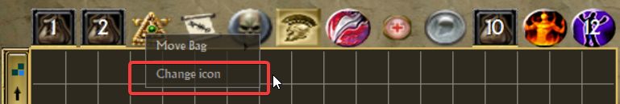
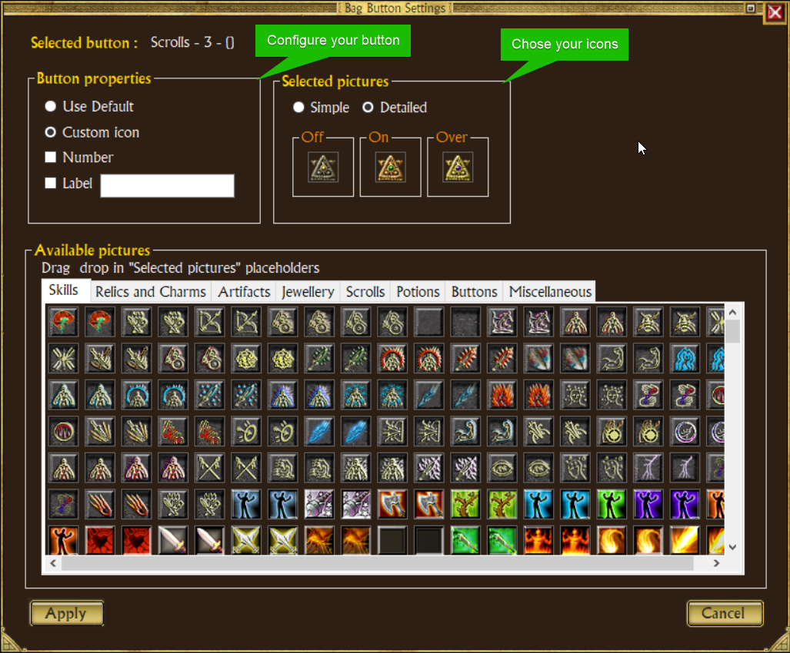

# Troubleshooting and F.A.Q.

<details>
<summary>

#### Does TQVaultAE modify my items? The stats I see are not the same as the ones ingame.
</summary>

> No, unless you specifically use the cheats, TQVaultAE doesn't alter items in any way.\
> The difference you see is simply due to the way stats are generated in Titan Quest: each item has base stats and a unique seed that modifies those stats.\
> TQVaultAE only displays the base stats (and not the modifications due to the RNG).
</details>

<details>
<summary>

#### Can I use TQVaultAE while playing the game?
</summary>

> Only when using the "Allow hot reload features" setting, otherwise it is not safe to do so.\
> Even then, be aware that any unsaved changes made in TQVaultAE will be lost when interacting with in-game inventories.
</details>

<details>
<summary>

#### What happened to my items, I transferred items to my character and they are not there in game?
</summary>

> If you are using the Steam version of the game, make sure Steam Cloud synchronization is disabled as it will overwrite local game saves modified by TQVaultAE with cloud older saves.
</details>

<details>
<summary>

#### How to enable/disable the cheats (character edition, item edition, item copy)?
</summary>

> There is a dedicated checkbox in the tool settings window.
</details>

<details>
<summary>

#### Can TQVaultAE use my old vault files?
</summary>

> Yes, TQVaultAE is compatible with the legacy TQvault vault files.
</details>

<details>
<summary>

#### Error Loading Resources. This may be caused by a bad language or game path setting.
</summary>

\
*Follow these steps:*
1. *Navigate the the installation folder of TQVaultAE*
2. *Open `UserConfig.xml` in a text editor (i.e. notepad, **not Microsoft Word**)*
3. *Replace the following sections:*

```xml
<AutoDetectGamePath>1</AutoDetectGamePath>
...
<TQITPath></TQITPath>
<TQPath></TQPath>
```

*by (replace the path to the correct one for your computer)*

```xml
<AutoDetectGamePath>0</AutoDetectGamePath>
...
<TQITPath>C:\examplePath\Titan Quest Anniversary Edition</TQITPath>
<TQPath>C:\examplePath\Titan Quest Anniversary Edition</TQPath>
```

4. *Open TQVaultAE*
    - *You might be greeted with a warning dialog about the vault path not being set. Click OK.*
5. *Open the configuration menu by clicking the top-left button*
6. *Validate the vault path and the game paths shown*
7. *Click OK to close the configuration menu*
</details>

<details>
<summary>

#### I have this game as a stand-alone (i.e. not through Steam or GOG). How can I make TQVaultAE work?
</summary>

> See the answer to "**Error Loading Resources. This may be caused by a bad language or game path setting.**" above
</details>

<details>
<summary>

#### Does TQVaultAE work with the Immortal Throne expansion?
</summary>

> *Yes*
</details>

<details>
<summary>

#### Does TQVaultAE work with the Ragnarok expansion?
</summary>

> *Yes*
</details>

<details>
<summary>

#### Does TQVaultAE work with the Atlantis expansion?
</summary>

> *Yes*
</details>

<details>
<summary>

#### Does TQVaultAE work with the Eternal Embers expansion?
</summary>

> *Yes*
</details>

<details>
<summary>

#### Can I still earn achievements while using TQVaultAE?
</summary>

> *Yes*
</details>

<details>
<summary>

#### How can i change my vault icons?
</summary>

\

\


</details>

<details>
<summary>

#### How can i adjust the volume?
</summary>

> You can enable/Disable the sounds in the tool settings window or adjust the volume via Windows Volume Mixer.
</details>

<details>
<summary>

#### I have a problem not listed here. What can I do?
</summary>

\
*There are several things you can do:*
- *Close TQVaultAE and open it up again. It may fix your problem*
- *Look up if your problem is featured in [our previously answered questions](https://github.com/EtienneLamoureux/TQVaultAE/issues?q=+is%3Aissue+label%3Aquestion+)*
- *Look up if your problem is featured in [TQVault's documentation](TQVault%20common%20issues.md)*
- *Create an issue in [our issue tracking board](https://github.com/EtienneLamoureux/TQVaultAE/issues)*
</details>
